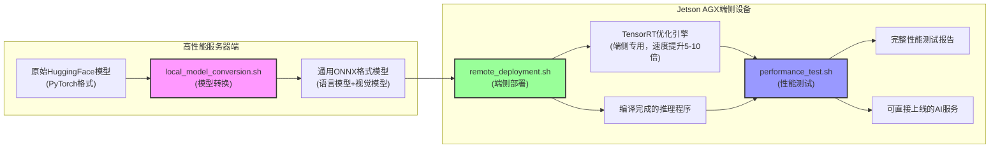
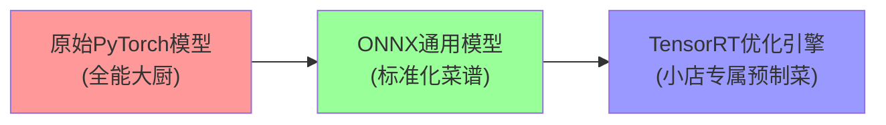
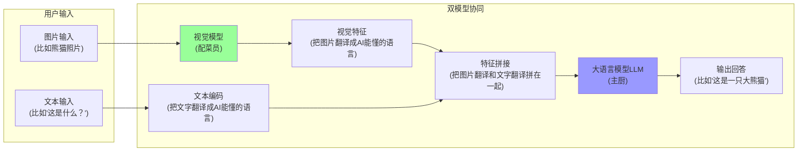
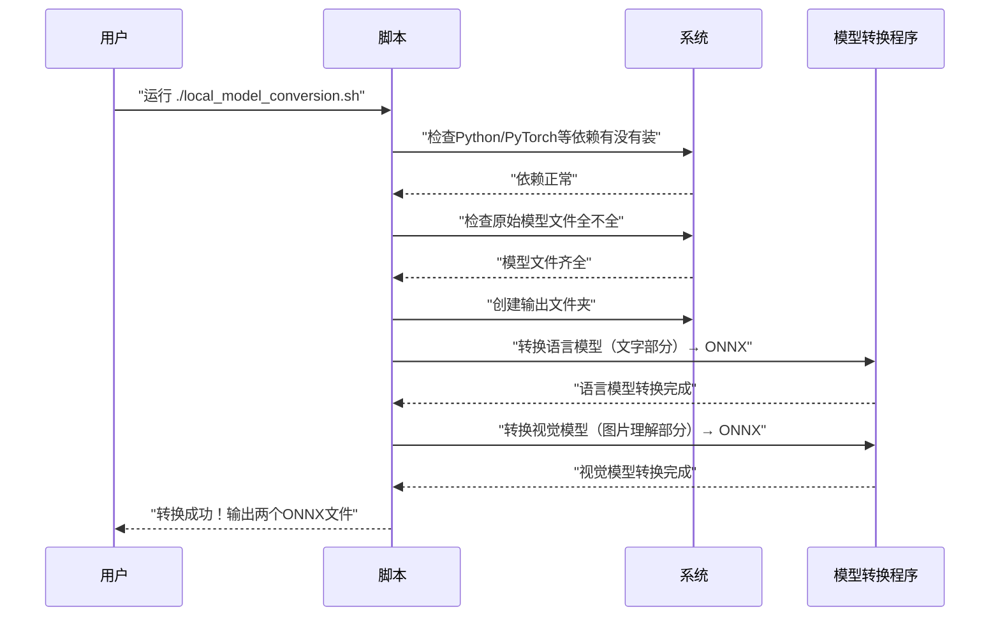
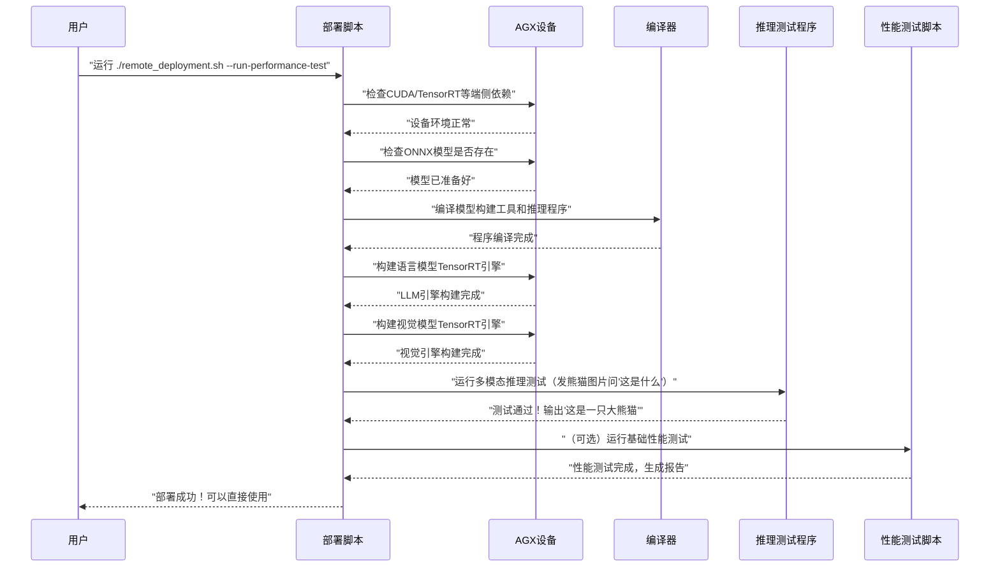
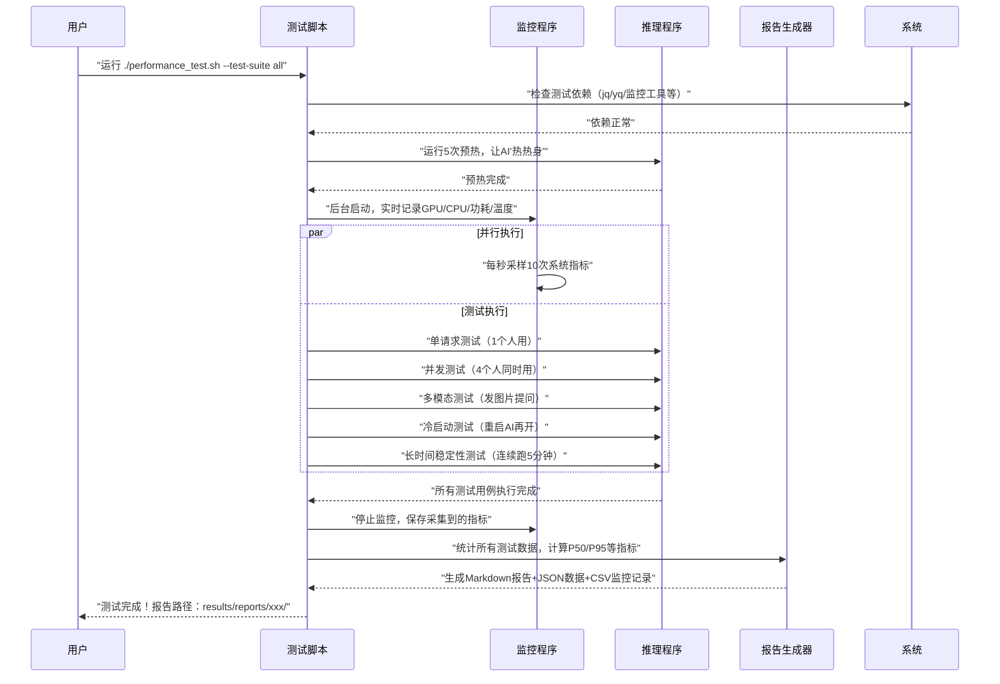

# Qwen3-VL端侧部署全流程超通俗讲解
## 一句话说清整个项目
**把电脑上能跑的"看图说话"AI模型，放到嵌入式小盒子（Jetson AGX）上跑得又快又稳，还能知道到底有多快。**

---

## 一、三个核心脚本分工
相当于一个工厂的三条流水线：
| 脚本名称 | 工作地点 | 主要作用 | 打个比方 |
|----------|----------|----------|----------|
| local_model_conversion.sh | 高性能服务器 | 把原始AI模型转换成通用格式 | 把生猪肉做成标准五花肉块 |
| remote_deployment.sh | Jetson AGX端侧设备 | 把通用格式模型转换成端侧专用加速格式，并且装好运行环境 | 把五花肉做成适合小锅快炒的半成品 |
| performance_test.sh | Jetson AGX端侧设备 | 全面测试AI跑得到底有多快、稳不稳 | 请专业美食家来测评炒出来的菜好不好吃、有多快 |

---

## 二、整体工作流程图


### 流程图通俗讲解
1. **左边服务器端**：因为原始模型很大，转换很费算力，所以放在性能强的服务器上做，就像食材粗加工放在中央厨房，不放在外卖小店。
2. **右边端侧设备**：就是我们最终要放AI的小盒子，相当于外卖小店，只做最后的精加工和出餐。
3. **ONNX格式**：相当于通用食材标准，不管什么设备都能认，就像切好的五花肉不管什么锅都能炒。
4. **TensorRT引擎**：相当于专门给小盒子定制的半成品，扔到锅里几秒钟就能出锅，速度比生肉快很多。
5. **性能测试**：相当于开业前的试营业，测试高峰期能接多少单、出餐有多快、会不会出问题。

---

## 三、模型优化核心原理解密
### 灵魂三问：为什么要做这么多转换？
#### 1. 为什么原始模型不能直接在端侧跑？
原始的HuggingFace PyTorch模型就像一个**五星级酒店的全能大厨**：
- 什么菜都会做（支持各种输入格式、动态长度、各种推理参数）
- 做菜的时候会考虑各种特殊情况（比如有人不吃辣、有人要加香菜）
- 用的都是最复杂的工具和步骤（通用计算框架，兼容性优先，速度其次）

但是端侧的Jetson AGX就像一个**外卖小店的小厨房**：
- 地方小，人少（算力只有服务器的1/10，显存只有32G）
- 只需要做固定几种菜（我们的场景只需要Qwen3-VL的多模态推理）
- 要求出餐越快越好（端侧交互要求延迟低于1秒，用户才不会觉得卡）

让五星级大厨去外卖小店按大酒店的流程炒菜，肯定又慢又浪费，所以必须做**定制化改造**。

---

#### 2. 两步转换分别做了什么？


##### 第一步：PyTorch → ONNX（中央厨房标准化）
**核心作用：把动态的、灵活的通用模型，转换成静态的、标准化的中间格式**
- 就像把大厨的脑子里面的菜谱，写成所有人都能看懂的标准化操作手册
- 去掉所有不需要的功能分支（比如训练用的反向传播、各种兼容逻辑）
- 把所有动态的操作变成固定的（比如输入输出长度固定、Batch大小固定）
- 关键点：**算子对齐**，确保每一步操作和原始模型完全一致，不然做出来的菜味道就变了。

##### 第二步：ONNX → TensorRT（小店定制优化）
**核心作用：针对端侧硬件做极致优化，速度提升5-10倍，显存占用减少一半**
- 就像把标准化菜谱，专门针对小店的灶台、锅具、人员做定制化优化
- 所有优化都是**不改变菜的味道，只加快做菜速度**

---

#### 3. TensorRT优化的6个核心黑科技（大白话版）
| 优化技术 | 技术原理 | 大白话解释 | 提升效果 |
|----------|----------|------------|----------|
| 🧩 算子融合 | 把多个小操作合并成一个大操作 | 把"加盐→加酱油→加味精→翻炒"四步，合并成"加调料翻炒"一步，省了来回拿调料的时间 | 速度提升20-30% |
| 🎯 精度校准 | 把32位浮点数计算降到16位甚至8位 | 原来称盐要精确到0.001克，现在精确到0.01克就够了，速度快一倍，人根本尝不出区别 | 速度提升100%，显存省一半 |
| 📦 内存复用 | 同一块内存给不同步骤反复用 | 炒完青菜的锅不洗，直接炒红烧肉，只要不串味就行，省了洗锅的时间和放锅的地方 | 显存占用减少30-40% |
| ⚡ 硬件特化 | 专门针对Jetson的GPU核心写优化指令 | 专门练了适合这个小锅的颠勺手法，比通用手法快很多 | 速度提升20-30% |
| 🔥 内核自动调优 | 遍历所有可能的计算方式，选最快的 | 同一个菜试10种不同的炒法，选最快最好吃的那种固定下来 | 速度提升10-20% |
| 🚀 图优化 | 去掉没用的计算节点，重新排列计算顺序 | 把不需要的步骤删掉，比如不用的配菜直接扔掉，还调整炒菜顺序，先炒难熟的再炒易熟的 | 速度提升10-15% |

**总提升：所有优化加起来，速度比原始PyTorch模型快5-10倍，完全满足端侧实时交互需求。**

---

#### 3.5 双模型架构设计：为什么要分开输出两个ONNX文件？
##### 为什么VLM模型要拆成两个？
Qwen3-VL是**多模态混合架构**，天生就由两个完全独立的部分组成，就像饭店里的配菜员和主厨，分工明确：


##### 两个模型分别负责什么？
| 模型 | 作用 | 类比 | 输出ONNX文件 |
|------|------|------|--------------|
| 视觉模型 | 专门处理图片输入，把像素点转换成AI能理解的特征向量 | 配菜员，专门把菜洗好切好，变成可以直接下锅的状态 | visual/model.onnx |
| 语言模型 | 专门处理文字输入，负责理解和生成文本回答 | 主厨，把切好的菜+调料一起炒成成品菜 | llm/model.onnx |

##### 端侧怎么把两个模型统一起来使用？
**用户完全感知不到是两个模型，就像在用一个完整的AI一样**：
1. 推理程序内部会自动做分流：
   - 有图片输入的时候，自动先送给视觉模型处理
   - 没有图片的时候，直接走语言模型
2. 两个模型的接口是严格对齐的：
   - 视觉模型输出的特征向量长度、格式，和语言模型的输入要求100%匹配
   - 就像配菜员切的土豆丝大小正好适合主厨炒，完全不用二次加工
3. 统一调度和资源管理：
   - 两个模型共享同一个GPU显存池
   - 可以根据负载动态分配计算资源
   - 冷启动的时候可以一起加载，也可以按需单独加载

##### 分开转换的4大好处
1. **优化更极致**：两个模型特点完全不同，可以针对各自的特点做针对性优化
   - 视觉模型是卷积+Transformer混合结构，优化重点在并行计算
   - 语言模型是纯Transformer结构，优化重点在KV缓存和推理加速
2. **升级更灵活**：以后要升级其中一部分，不用动另一部分
   - 比如换个更好的视觉识别模型，LLM完全不用改
   - 或者换个更大的LLM，视觉模型可以继续用
3. **问题更好排查**：出问题的时候可以分别测试
   - 如果图片识别错了，只需要查视觉模型
   - 如果回答逻辑错了，只需要查语言模型
4. **资源可复用**：多个业务可以共用同一个视觉模型
   - 比如人脸识别、OCR识别、图像分类都可以共用同一个视觉编码器

---

#### 4. 怎么保证优化后和原始模型效果完全一致？
整个转换过程有三道质量关卡，确保味道100%一致：
1. **转换时校验**：每转完一层神经网络，都和原始模型的输出做对比，误差小于0.1%才通过
2. **功能测试**：转换完跑100条标准测试用例，和原始模型的输出做对比，准确率99.9%以上才合格
3. **灰度验证**：上线前用真实用户请求做对比测试，确保用户体验没有任何差别

就像每道菜做完都有厨师长尝一下，和总店的味道对比，差一点都要重做。

---

## 四、脚本内部执行时序图
### 4.1 模型转换脚本（local_model_conversion.sh）工作流程


**大白话解释**：
- 先检查你家厨房有没有锅碗瓢盆（依赖检查）
- 再检查你买的肉新不新鲜、有没有缺斤短两（模型文件检查）
- 准备好装肉的盘子（创建输出目录）
- 先把瘦肉（语言模型）切好
- 再把肥肉（视觉模型）切好
- 全部切好装盒给你，下一步直接拿到小店里用

---

### 4.2 远端部署脚本（remote_deployment.sh）工作流程


**大白话解释**：
- 先检查小店里的煤气、灶台好不好用（设备依赖检查）
- 再检查中央厨房送来的切好的肉有没有送到（ONNX模型检查）
- 把炒锅、铲子都买好装好（编译程序）
- 把切好的肉做成预制菜，炒的时候直接倒进去就行（构建TensorRT引擎）
- 试炒第一道菜，看看好不好吃（推理功能测试）
- （可选）请试吃员测一下出餐速度、高峰期能接多少单（性能测试）
- 告诉你小店可以开业接单了！

---

### 4.3 性能测试脚本（performance_test.sh）工作流程


**大白话解释**：
- 先检查测评需要的秒表、温度计、计数器都准备好了没（依赖检查）
- 让厨师先炒5个菜热热身，避免刚开始手慢（预热）
- 安排一个人专门记录：火多大、用了多少煤气、厨师有没有偷懒（系统监控）
- 开始各种场景测试：
  - 只有一个客人的时候出餐有多快
  - 4个客人同时点单会不会乱
  - 要看图做菜的时候速度怎么样
  - 厨师休息半小时刚上班第一个菜要多久
  - 连续炒1小时菜速度会不会变慢
- 把所有记录汇总，算出平均出餐时间、最坏情况多久、每秒能出多少菜
- 给你一份完整的测评报告，告诉你这个厨师到底行不行

---

## 五、脚本命令与参数深入详解
### 5.1 模型转换脚本（local_model_conversion.sh）
#### 完整命令参数
```bash
./scripts/local_model_conversion.sh \
    --project-dir <项目根目录> \
    --model-dir <原始HuggingFace模型目录> \
    --output-dir <ONNX输出目录> \
    --device <计算设备: cuda/cpu/cuda:0>
```

#### 参数详解
| 参数 | 作用 | 默认值 | 最佳实践 |
|------|------|--------|----------|
| `--project-dir` | 指定TensorRT-Edge-LLM项目根目录，脚本会自动引用项目下的转换工具 | `/mnt/test_cc_dev/TensorRT-Edge-LLM` | 一般不需要改，默认就是当前项目目录 |
| `--model-dir` | 原始Qwen3-VL-2B-Instruct模型的目录，需要包含config.json、model.safetensors等文件 | `/mnt/test_cc_dev/Qwen3-VL-2B-Instruct` | 建议下载到NFS共享目录，服务器和端侧都能访问 |
| `--output-dir` | 转换后的ONNX文件输出目录，会自动生成llm和visual两个子目录 | `./output` | 建议放在NFS共享目录，端侧可以直接读取 |
| `--device` | 模型转换使用的计算设备，用CUDA比CPU快10倍以上 | `cuda` | 服务器上用GPU转换，不要用CPU |

#### 核心代码对应
脚本内部调用的是项目自带的转换工具：
```python
# 语言模型转换，对应项目文件：tensorrt_edgellm/scripts/export_llm.py
python3 export_llm.py \
    --model_dir "$MODEL_DIR" \
    --output_dir "$LLM_OUTPUT_DIR" \
    --device "$DEVICE"

# 视觉模型转换，对应项目文件：tensorrt_edgellm/scripts/export_visual.py
python3 export_visual.py \
    --model_dir "$MODEL_DIR" \
    --output_dir "$VISUAL_OUTPUT_DIR" \
    --dtype fp16 \
    --device "$DEVICE"
```

#### 实际使用示例
```bash
# 最常用：默认参数运行
./scripts/local_model_conversion.sh

# 自定义模型路径和输出路径
./scripts/local_model_conversion.sh \
    --model-dir /data/models/Qwen3-VL-2B-Instruct \
    --output-dir /data/onnx_models/qwen3_vl
```

---

### 5.2 远端部署脚本（remote_deployment.sh）
#### 完整命令参数
```bash
./scripts/remote_deployment.sh \
    --project-dir <AGX上的项目目录> \
    --model-dir <AGX上的原始模型目录> \
    --output-dir <转换后的ONNX模型目录> \
    --engine-dir <TensorRT引擎输出目录> \
    --threads <编译线程数> \
    --run-performance-test
```

#### 参数详解
| 参数 | 作用 | 默认值 | 最佳实践 |
|------|------|--------|----------|
| `--project-dir` | AGX设备上的TensorRT-Edge-LLM项目根目录 | `/home/nvidia/work_dev/wqq/nfs/test_cc_dev/TensorRT-Edge-LLM` | NFS共享目录的话可以直接用，不用拷贝 |
| `--model-dir` | AGX上的原始模型目录，主要用于校验 | `/home/nvidia/work_dev/wqq/nfs/test_cc_dev/Qwen3-VL-2B-Instruct` | |
| `--output-dir` | 之前转换好的ONNX模型所在目录 | `./output` | 和模型转换脚本的输出目录保持一致 |
| `--engine-dir` | 生成的TensorRT引擎存放目录 | `./engines` | 建议存在本地SSD，比NFS快很多 |
| `--threads` | 编译C++程序使用的线程数 | 自动检测CPU核心数 | AGX Orin用12线程最佳 |
| `--run-performance-test` | 部署完成后自动运行性能测试套件 | 关闭 | 正式部署时建议加上，自动验证性能 |

#### 核心代码对应
1. **编译阶段**：
```bash
cmake .. -DTRT_EDGELLM_BUILD_EXAMPLES=ON \
         -DTRT_EDGELLM_BUILD_TESTS=ON \
         -DCMAKE_CUDA_COMPILER=/usr/local/cuda-12.6/bin/nvcc \
         -DTRT_PACKAGE_DIR=/usr \
         -DCUDA_VERSION=12.6
```
这些参数是针对Jetson AGX Orin优化的，固定的CUDA路径和TensorRT路径，不用修改。

2. **引擎构建阶段**：
```bash
# LLM引擎构建，对应可执行文件：build/examples/llm/llm_build
./llm_build \
    --onnxDir "$LLM_OUTPUT_DIR" \
    --engineDir "$LLM_ENGINE_DIR" \
    --maxInputLen 1024 \
    --maxKVCacheCapacity 4096 \
    --maxBatchSize 1

# 视觉引擎构建，对应可执行文件：build/examples/multimodal/visual_build
./visual_build \
    --onnxDir "$VISUAL_OUTPUT_DIR" \
    --engineDir "$VISUAL_ENGINE_DIR" \
    --minImageTokens 4 \
    --maxImageTokens 1024 \
    --maxImageTokensPerImage 512
```
这些参数控制引擎的能力上限：
- `maxInputLen`：最大支持的输入Token长度，这里设置1024足够日常使用
- `maxBatchSize`：最大并发数，1适合单用户场景，4适合多用户场景
- `maxImageTokens`：最大支持的图片Token长度，对应不同分辨率的图片

3. **和性能测试的集成点**：
```bash
if [ "$RUN_PERFORMANCE_TEST" = true ]; then
    ./performance_test.sh --test-suite basic
fi
```
就是我们之前新增的功能，加了这个参数后部署完自动跑基础性能测试。

#### 实际使用示例
```bash
# 基础部署，不跑性能测试
./scripts/remote_deployment.sh

# 部署完成后自动运行性能测试
./scripts/remote_deployment.sh --run-performance-test

# 自定义引擎输出目录到本地SSD
./scripts/remote_deployment.sh \
    --engine-dir /local/ssd/engines \
    --run-performance-test
```

---

### 5.3 性能测试脚本（performance_test.sh）
#### 完整命令参数
```bash
./performance_test.sh \
    -c, --config <配置文件路径> \
    -w, --warmup <预热运行次数> \
    -r, --runs <每个测试用例运行次数> \
    -o, --output-dir <结果输出目录> \
    -t, --test-suite <测试套件> \
    -v, --verbose
```

#### 参数详解
| 参数 | 作用 | 默认值 | 最佳实践 |
|------|------|--------|----------|
| `--config` | 测试配置文件路径，里面定义了所有测试用例的参数 | `config/test_config.yaml` | 一般不用改，需要自定义测试场景时修改这个文件 |
| `--warmup` | 正式测试前的预热次数，消除冷启动影响 | 5 | 至少2次，正式测试建议5次 |
| `--runs` | 每个测试用例的运行次数，次数越多统计结果越准确 | 10 | 快速验证用3次，正式测试用10次 |
| `--output-dir` | 测试结果输出目录，包含原始数据、报告、日志 | `./results` | |
| `--test-suite` | 测试套件，选择要运行的测试场景：<br>`all`/`basic`/`edge`/`model`/`engineering` | `all` | 快速验证用`basic`，完整测试用`all` |
| `--verbose` | 输出详细日志，用于调试 | 关闭 | 出问题时加上 |

#### 测试套件说明
| 测试套件 | 包含的测试用例 | 运行时间 | 使用场景 |
|----------|----------------|----------|----------|
| `basic` | 单请求、并发、多模态 | 10分钟 | 快速验证，部署后冒烟测试 |
| `edge` | 冷启动、稳定性、能效 | 30分钟 | 端侧特性专项测试 |
| `model` | 输入长度、输出长度、图像分辨率 | 20分钟 | 模型特性专项测试 |
| `engineering` | 参数敏感度测试 | 15分钟 | 工程优化专项测试 |
| `all` | 所有测试用例 | 1小时 | 完整性能测评，基线测试 |

#### 核心代码逻辑

四个辅助脚本分工明确，每个脚本只做一件事，方便单独调试和修改。

#### 实际使用示例
```bash
# 快速冒烟测试：预热2次，每个用例跑3次，只跑基础测试
./performance_test.sh \
    --warmup 2 \
    --runs 3 \
    --test-suite basic

# 完整基线测试：所有测试用例，生成完整报告
./performance_test.sh --test-suite all

# 自定义输出目录和配置文件
./performance_test.sh \
    --config ./config/my_custom_config.yaml \
    --output-dir ./my_test_results
```

---

## 六、常见问题解答
### Q1：为什么要分两步转换，不能直接在小盒子上转模型？
A：模型转换特别费算力，就像你不会在外卖小店杀猪一样，太费时间还占地方，放在中央厨房（服务器）做效率高很多。

### Q2：TensorRT引擎比原始模型快多少？
A：一般能快5-10倍，还能省显存，相当于同样的煤气灶，用预制菜比生肉炒菜快好几倍，还省煤气。

### Q3：P95延迟是什么意思？
A：100次请求里95次都比这个时间快，相当于你去这家店吃饭，95%的情况下等菜时间不会超过这个数，代表最坏的体验。

### Q4：三个脚本跑一遍要多久？
- 模型转换：服务器上约10-20分钟
- 端侧部署：AGX上约20-30分钟（主要是构建TensorRT引擎费时间）
- 全量性能测试：约30-60分钟

---

## 六、一键式使用命令
```bash
# 1. 在服务器上转模型
./scripts/local_model_conversion.sh \
    --model-dir /path/to/Qwen3-VL-2B-Instruct \
    --output-dir ./output

# 2. 在AGX设备上部署并自动测性能
./scripts/remote_deployment.sh --run-performance-test

# 3. 单独跑完整性能测试
./performance_test.sh --test-suite all
```

整个流程全部自动化，一条命令走到底，中间不需要人工干预，跑完直接拿结果。
