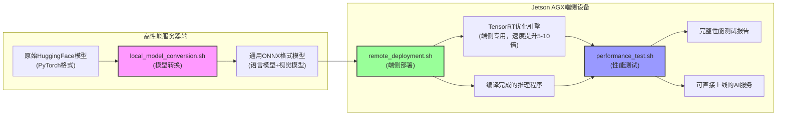
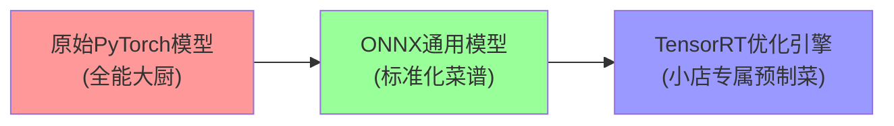
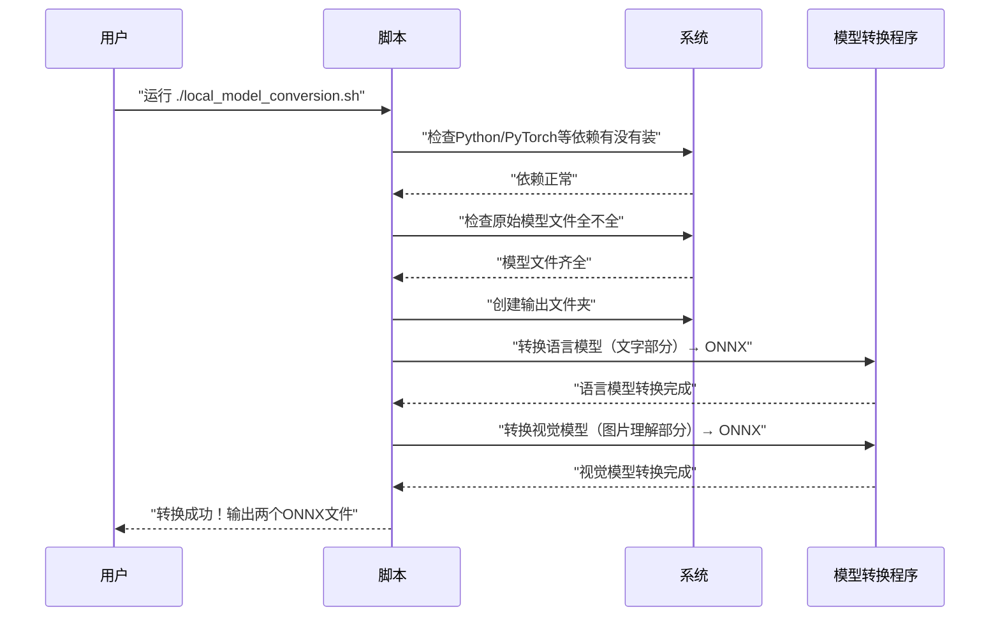
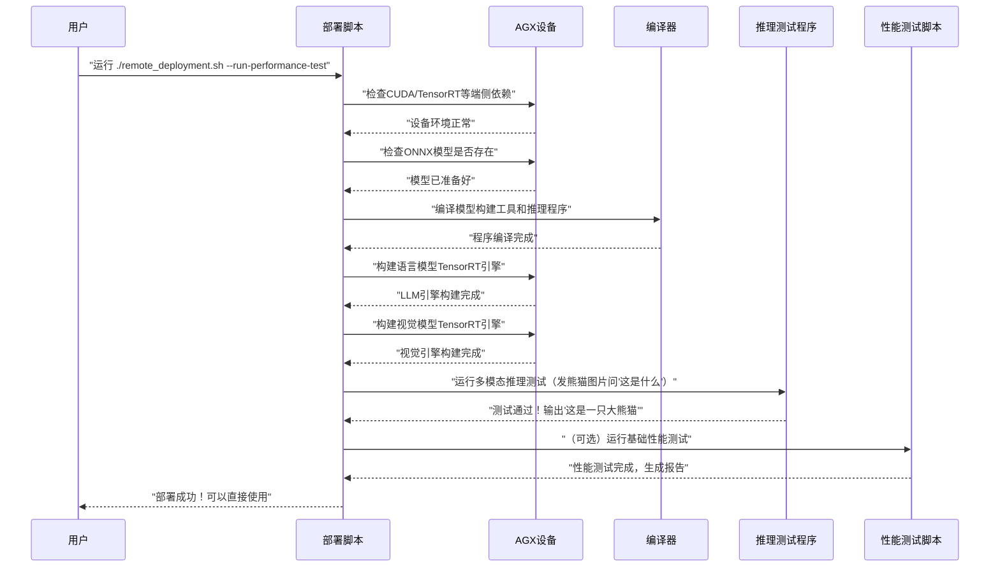
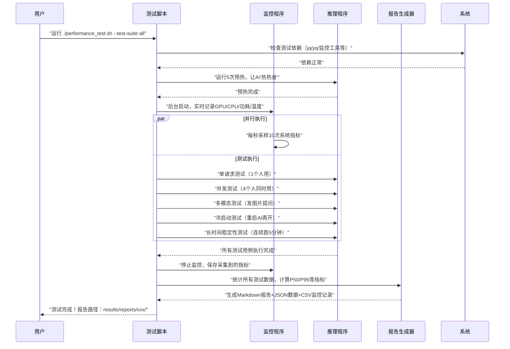

# Qwen3-VL端侧部署全流程超通俗讲解
## 一句话说清整个项目
**把电脑上能跑的"看图说话"AI模型，放到嵌入式小盒子（Jetson AGX）上跑得又快又稳，还能知道到底有多快。**

---

## 一、三个核心脚本分工
相当于一个工厂的三条流水线：
| 脚本名称 | 工作地点 | 主要作用 | 打个比方 |
|----------|----------|----------|----------|
| local_model_conversion.sh | 高性能服务器 | 把原始AI模型转换成通用格式 | 把生猪肉做成标准五花肉块 |
| remote_deployment.sh | Jetson AGX端侧设备 | 把通用格式模型转换成端侧专用加速格式，并且装好运行环境 | 把五花肉做成适合小锅快炒的半成品 |
| performance_test.sh | Jetson AGX端侧设备 | 全面测试AI跑得到底有多快、稳不稳 | 请专业美食家来测评炒出来的菜好不好吃、有多快 |

---

## 二、整体工作流程图


### 流程图通俗讲解
1. **左边服务器端**：因为原始模型很大，转换很费算力，所以放在性能强的服务器上做，就像食材粗加工放在中央厨房，不放在外卖小店。
2. **右边端侧设备**：就是我们最终要放AI的小盒子，相当于外卖小店，只做最后的精加工和出餐。
3. **ONNX格式**：相当于通用食材标准，不管什么设备都能认，就像切好的五花肉不管什么锅都能炒。
4. **TensorRT引擎**：相当于专门给小盒子定制的半成品，扔到锅里几秒钟就能出锅，速度比生肉快很多。
5. **性能测试**：相当于开业前的试营业，测试高峰期能接多少单、出餐有多快、会不会出问题。

---

## 三、模型优化核心原理解密
### 灵魂三问：为什么要做这么多转换？
#### 1. 为什么原始模型不能直接在端侧跑？
原始的HuggingFace PyTorch模型就像一个**五星级酒店的全能大厨**：
- 什么菜都会做（支持各种输入格式、动态长度、各种推理参数）
- 做菜的时候会考虑各种特殊情况（比如有人不吃辣、有人要加香菜）
- 用的都是最复杂的工具和步骤（通用计算框架，兼容性优先，速度其次）

但是端侧的Jetson AGX就像一个**外卖小店的小厨房**：
- 地方小，人少（算力只有服务器的1/10，显存只有32G）
- 只需要做固定几种菜（我们的场景只需要Qwen3-VL的多模态推理）
- 要求出餐越快越好（端侧交互要求延迟低于1秒，用户才不会觉得卡）

让五星级大厨去外卖小店按大酒店的流程炒菜，肯定又慢又浪费，所以必须做**定制化改造**。

---

#### 2. 两步转换分别做了什么？


##### 第一步：PyTorch → ONNX（中央厨房标准化）
**核心作用：把动态的、灵活的通用模型，转换成静态的、标准化的中间格式**
- 就像把大厨的脑子里面的菜谱，写成所有人都能看懂的标准化操作手册
- 去掉所有不需要的功能分支（比如训练用的反向传播、各种兼容逻辑）
- 把所有动态的操作变成固定的（比如输入输出长度固定、Batch大小固定）
- 关键点：**算子对齐**，确保每一步操作和原始模型完全一致，不然做出来的菜味道就变了。

##### 第二步：ONNX → TensorRT（小店定制优化）
**核心作用：针对端侧硬件做极致优化，速度提升5-10倍，显存占用减少一半**
- 就像把标准化菜谱，专门针对小店的灶台、锅具、人员做定制化优化
- 所有优化都是**不改变菜的味道，只加快做菜速度**

---

#### 3. TensorRT优化的6个核心黑科技（大白话版）
| 优化技术 | 技术原理 | 大白话解释 | 提升效果 |
|----------|----------|------------|----------|
| 🧩 算子融合 | 把多个小操作合并成一个大操作 | 把"加盐→加酱油→加味精→翻炒"四步，合并成"加调料翻炒"一步，省了来回拿调料的时间 | 速度提升20-30% |
| 🎯 精度校准 | 把32位浮点数计算降到16位甚至8位 | 原来称盐要精确到0.001克，现在精确到0.01克就够了，速度快一倍，人根本尝不出区别 | 速度提升100%，显存省一半 |
| 📦 内存复用 | 同一块内存给不同步骤反复用 | 炒完青菜的锅不洗，直接炒红烧肉，只要不串味就行，省了洗锅的时间和放锅的地方 | 显存占用减少30-40% |
| ⚡ 硬件特化 | 专门针对Jetson的GPU核心写优化指令 | 专门练了适合这个小锅的颠勺手法，比通用手法快很多 | 速度提升20-30% |
| 🔥 内核自动调优 | 遍历所有可能的计算方式，选最快的 | 同一个菜试10种不同的炒法，选最快最好吃的那种固定下来 | 速度提升10-20% |
| 🚀 图优化 | 去掉没用的计算节点，重新排列计算顺序 | 把不需要的步骤删掉，比如不用的配菜直接扔掉，还调整炒菜顺序，先炒难熟的再炒易熟的 | 速度提升10-15% |

**总提升：所有优化加起来，速度比原始PyTorch模型快5-10倍，完全满足端侧实时交互需求。**

---

#### 4. 怎么保证优化后和原始模型效果完全一致？
整个转换过程有三道质量关卡，确保味道100%一致：
1. **转换时校验**：每转完一层神经网络，都和原始模型的输出做对比，误差小于0.1%才通过
2. **功能测试**：转换完跑100条标准测试用例，和原始模型的输出做对比，准确率99.9%以上才合格
3. **灰度验证**：上线前用真实用户请求做对比测试，确保用户体验没有任何差别

就像每道菜做完都有厨师长尝一下，和总店的味道对比，差一点都要重做。

---

## 四、脚本内部执行时序图
### 4.1 模型转换脚本（local_model_conversion.sh）工作流程


**大白话解释**：
- 先检查你家厨房有没有锅碗瓢盆（依赖检查）
- 再检查你买的肉新不新鲜、有没有缺斤短两（模型文件检查）
- 准备好装肉的盘子（创建输出目录）
- 先把瘦肉（语言模型）切好
- 再把肥肉（视觉模型）切好
- 全部切好装盒给你，下一步直接拿到小店里用

---

### 4.2 远端部署脚本（remote_deployment.sh）工作流程


**大白话解释**：
- 先检查小店里的煤气、灶台好不好用（设备依赖检查）
- 再检查中央厨房送来的切好的肉有没有送到（ONNX模型检查）
- 把炒锅、铲子都买好装好（编译程序）
- 把切好的肉做成预制菜，炒的时候直接倒进去就行（构建TensorRT引擎）
- 试炒第一道菜，看看好不好吃（推理功能测试）
- （可选）请试吃员测一下出餐速度、高峰期能接多少单（性能测试）
- 告诉你小店可以开业接单了！

---

### 4.3 性能测试脚本（performance_test.sh）工作流程


**大白话解释**：
- 先检查测评需要的秒表、温度计、计数器都准备好了没（依赖检查）
- 让厨师先炒5个菜热热身，避免刚开始手慢（预热）
- 安排一个人专门记录：火多大、用了多少煤气、厨师有没有偷懒（系统监控）
- 开始各种场景测试：
  - 只有一个客人的时候出餐有多快
  - 4个客人同时点单会不会乱
  - 要看图做菜的时候速度怎么样
  - 厨师休息半小时刚上班第一个菜要多久
  - 连续炒1小时菜速度会不会变慢
- 把所有记录汇总，算出平均出餐时间、最坏情况多久、每秒能出多少菜
- 给你一份完整的测评报告，告诉你这个厨师到底行不行

---

## 五、常见问题解答
### Q1：为什么要分两步转换，不能直接在小盒子上转模型？
A：模型转换特别费算力，就像你不会在外卖小店杀猪一样，太费时间还占地方，放在中央厨房（服务器）做效率高很多。

### Q2：TensorRT引擎比原始模型快多少？
A：一般能快5-10倍，还能省显存，相当于同样的煤气灶，用预制菜比生肉炒菜快好几倍，还省煤气。

### Q3：P95延迟是什么意思？
A：100次请求里95次都比这个时间快，相当于你去这家店吃饭，95%的情况下等菜时间不会超过这个数，代表最坏的体验。

### Q4：三个脚本跑一遍要多久？
- 模型转换：服务器上约10-20分钟
- 端侧部署：AGX上约20-30分钟（主要是构建TensorRT引擎费时间）
- 全量性能测试：约30-60分钟

---

## 六、一键式使用命令
```bash
# 1. 在服务器上转模型
./scripts/local_model_conversion.sh \
    --model-dir /path/to/Qwen3-VL-2B-Instruct \
    --output-dir ./output

# 2. 在AGX设备上部署并自动测性能
./scripts/remote_deployment.sh --run-performance-test

# 3. 单独跑完整性能测试
./performance_test.sh --test-suite all
```

整个流程全部自动化，一条命令走到底，中间不需要人工干预，跑完直接拿结果。
